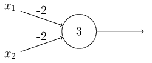
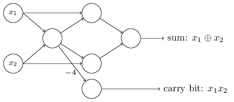
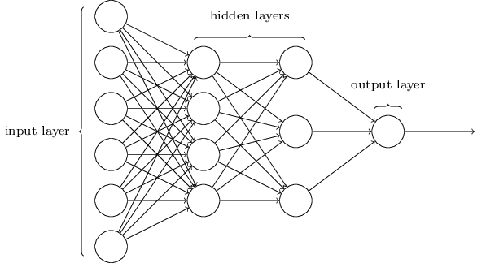
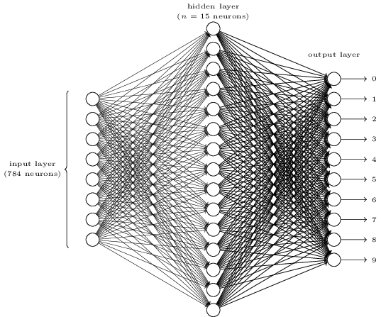

# Chapter 1 - Using Neural Networks To Recognize Handwritten Digits

Neural networks are a learning system, that take a training set of data and infer rules for pattern recognition

### Perceptrons

- An artificial neuron
- It takes several binary inputs and produces a single binary output
- Can be layered to make more complex decisions
- Is tuned with a bias factor, which is measure of how easy it is for a perception to fire
- See below a NAND gate and Adder (with carry) represented by a perceptron

  
Perceptron

  
NAND Adder

  
Perceptron Adder

### Sigmoid Neurons

- For learning to occur a small change in a weight (bias) should only cause a small change in the output
- Takes an input between 0 and 1 and computes a sigmoid function
- The sigmoid function is good because it behaves like a step function, except for right around the point right around where it flips from positive to negative

### The Architecture Of Neural Networks

- Input Layer - the neurons that take input from outside the network
- Output Layer - the neurons that output the result to outside of the network
- Hidden Layer (Middle Layer) - neither inputs or output neurons, there can be multiple hidden layers
- Multi-layer networks are often (confusingly) referred to as Multilayer Perceptrons (MLP)
- In the number detection example each neuron is presented a pixel. So if a 64 by 64 grey scale image is passed into the system there are 4096 (64 x 64) input neurons
- Feedforward neural networks are neural networks where the output of one layer is passed into the input of another layer, i.e. the information is never fed back into a previous layer
- Recurrent neural networks are neural networks where one layer is fed back into a previous layer, creating a feedback loop

  
Layers

### A Simple Network To Classify Digits

- It's best to break the higher order problem into two subproblems
  - Breaking an image into a sequence of separate images containing the digits (segmentation)
  - Classifying the individual digits
- This section we'll focus on individual digits
- One approach to solving the segmentation problem is the split up the image into multiple images and try to classify each segment with the classification algorithm
- This approach we'll use a three layered neural network that's looking at 28 x 28 pixel images
  - Input layer is 784 (28 x 28) neurons
  - The hidden layer contains 15 neurons (which will be a number to play around with)
  - Output layer is 10 neurons (one for each digit)
  - It's possible to have less output neurons, but (at least for now) is not as accurate a the 10 neuron solution

  
Digit Classifier
